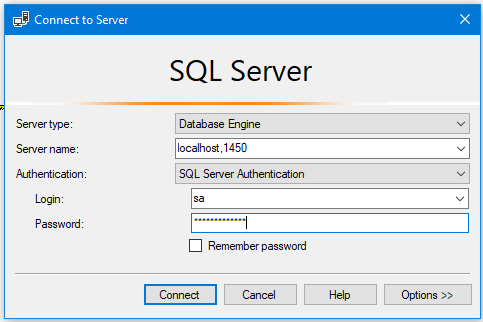

# Teste Banco Carrefour


- Utilizamos DDD para construção dos servicos (Lancamento e Relatorio) utilizando c# .Net 6 + MSSQL 2019
- Utilizamos Database First
- Utilizamos Docker Desktop v4.5.1 (74721)
- O contexto possui Testes Unitarios para os validadores
- Configuramos o Swagger para testes


----

## Montar o ambiente para testes locais

- Baixar a imagem do MSSQL e .Net 6

```
	docker pull mcr.microsoft.com/mssql/server:2019-latest
	docker pull mcr.microsoft.com/dotnet/sdk:6.0
	docker pull mcr.microsoft.com/dotnet/aspnet:6.0
```
	
- Clonar este repositorio para a maquina local

- Rodar Script Docker para subir a aplicacao

```
	docker build -t carrefour-image .
	docker-compose up
```

- Acessar o MSSQL atraves do SSMS 
	- Server = localhost,1450
	- SQL User Authentication 
	- Login = sa
	- Password = Pa55w0rd#2022
	

	
	- Criar o database - ./scripts/CriacaoDoDatabase.sql 
	- Criar as tabelas - ./scripts/CriacaoDasTabelas.sql


----

## Testes dos servicos

- Dentro do diretorio ./script temos o lancamentos.ps1 e lancamentos.csv para popular as tabelas (gera lancamentos.csv_log.json)

- No lancamento dos valores, a data do documento não pode ser uma data futura. (podemos implementar isso no futuro :)

- Usando o VS 2022, com o IIS Express
	http://localhost:56825/swagger/index.html

- Usando a aplicacao com Docker:
	http://localhost:8080/swagger/index.html

- Para rodar o relatorio no browser:
	http://localhost:8080/api/Relatorio/saldo?dataInicial=2022-09-01&sintetico=true

	- temos data inicial e data final do periodo, sendo que a data inicial é obrigatoria.
	- temos o query sintetico, quando false, tras no campo valores, um array dos lancamentos do dia
